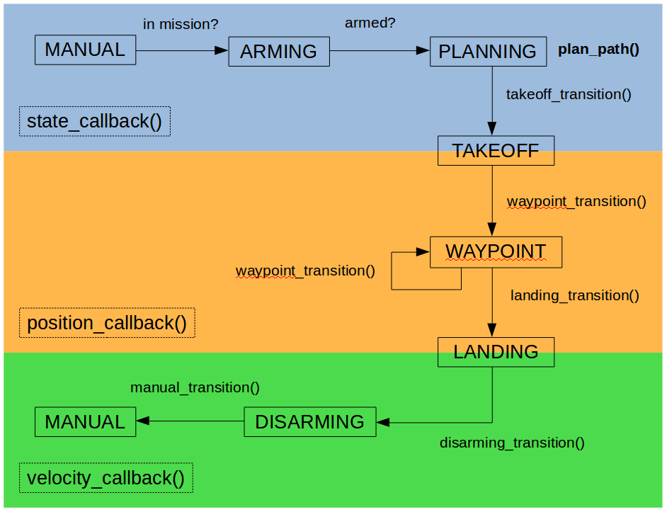
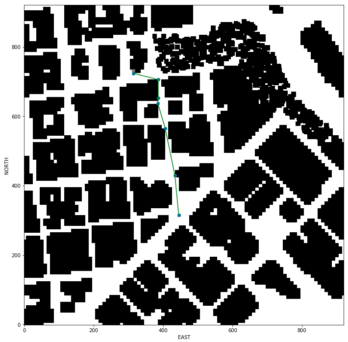
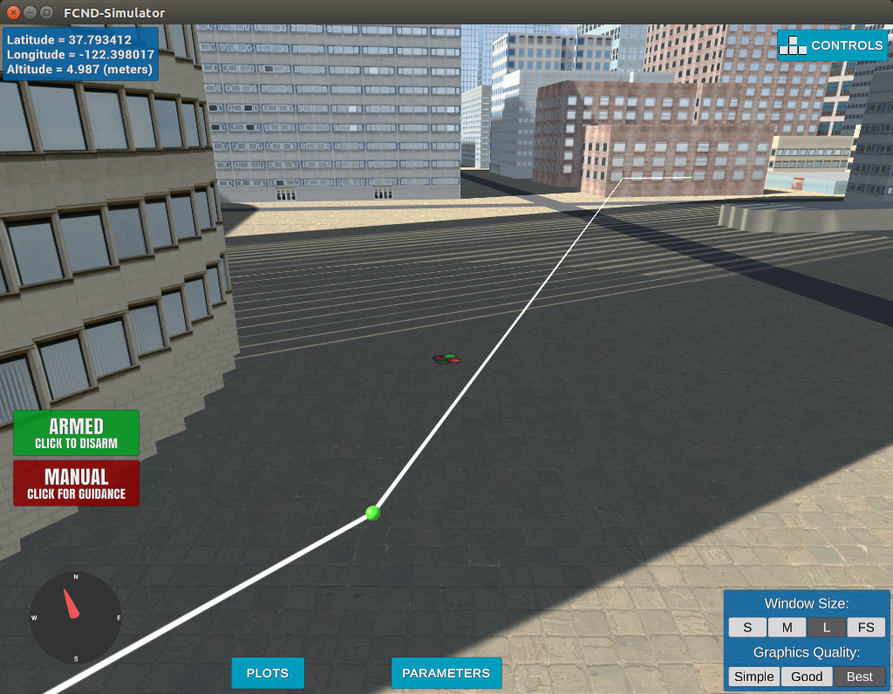

## Project: 3D Motion Planning

---

### The goals of this project are:
1. Loading a 2.5D map from the colliders.csv file describing the environment.
2. Discretize the environment into a grid or graph representation.
3. Define the start and goal locations.
4. Perform a search using A* or other search algorithm.
5. Use a collinearity test or ray tracing method (like Bresenham) to remove unnecessary waypoints.
6. Return waypoints in local ECEF coordinates (format for `self.all_waypoints` is [N, E, altitude, heading], where the drone’s start location corresponds to [0, 0, 0, 0].

---

### General structure of the code

The scripts `motion_planning.py` and `planning_utils.py` contain the basic planning implementation. The following section describes the general structure of the code.

#### Basic Structure of `motion_planning.py`

- connect to simulator
- register three callback methods to messages returned from simulator - `state_callback()`, `local_position_callback()`, and `velocity_callback()`. The state diagram looks as follows:

- `state_callback()` is controlling the states from MANUAL to TAKEOFF and is calling the method `plan_path()`, where most of the project implementation takes place.
- `local_position_callback()` is controlling the states from TAKEOFF to LANDING and is responsible for following the waypoints that are calculated by the path planing algorithm. This portion was not changed in this project.  
- `velocity_callback()` is controlling the states from LANDING back to MANUAL and was also not modified in this project.

- Structure of `plan_path()`:
	- define target altitude and safety distance
	- set target position height to target altitude
	- read lattitude and longtitude from `colliders.csv` and set home position
	- convert global home position to relative local (north, east) position
	- read in obstacle map and convert to 2D grid at target altitude with safety distance using the method `create_grid()`
	- convert relative local position to grid local position
	- save specific global target positions in array and select one randomly
	- convert the global target lcoation to grid specific local position
	- use `a_star()` from `planning_utils.py` to find path from local start to goal
	- prune the path via `prune_path()` from `planning_utils.py`
	- convert path to waypoints, visualize them in simulator and follow them

#### Structure of `planning_utils.py`

 -  `planning_utils.py` contains several functions that are used in the planning process:
 	- `create_grid()`: calculates a 2D grid from 2.5D map data and returns the grid as well as grid minimum values for north and east coordinates 
 	- `valid_actions()`: takes a current node and grid and looks through all possible actions to check if they are valid. A list of valid actions is then returned.
 	- `a_star_nesw()`: basic A* implementation that calculates a path from a start to a goal location; only takes the original actions moving north, east, south, and west
 	- `a_star()`: basic A* implementation that calculates a path from a start to a goal location; including diagonal movements as possible actions
 	- `heuristic()`: basic heuristic function calculating on Euclidean distance
 	- `collinearity_check()`: simple colinearity check of 3 points with given epsilon
 	- `prune_path()`: path pruning algorithm using the `collinearity_check()`
 	- `prune_path_bres()`: path pruning algorithm using Bresenham

---

### Environment / Map for this project

This is the part of San Francisco that is used in this scenario (picture from Google Maps):

This is a zoomed in view of the same section in the simulator: 

---

### Implementation of the Path Planning Algorithm

#### 1. Set your global home position
The first line of `colliders.csv` is read and the two values for `lat0` and `lon0` is extracted as float values. Those values are then used to set the global home position via the method `self.set_global_home_position()`.

<a href="/motion_planning.py#L126-L134">see `motion_planning.py`, line 126-134</a>

#### 2. Set your current local position
The local position relative to the gloabl home position is calculated via the method `global_to_local()` from `frame_utils.py`.

<a href="/motion_planning.py#L137">see `motion_planning.py`, line 137</a>

#### 3. Set grid start position from local position
The method `create_grid()` from `planning_utils.py` is used to calculate the grid as well as the offset positions for both directions - north and east. The offsets are then substracted from the current local position values to receive the grid starting positions.

<a href="/motion_planning.py#L145-L151">see `motion_planning.py`,  line 145-151</a>

#### 4. Set grid goal position from geodetic coords
A couple of predefined global goal positions are saved in the numpy array `global_goals`. One goal is then randomly selected and converted into a local goal position in respect to the gloabl home position via `global_to_local()`. The respective grid goal position is then calculated by adding the grid starting positions to the north and east position values.

<a href="/motion_planning.py#L161-L177">see `motion_planning.py`,  line 161-177</a>

#### 5. Modify A* to include diagonal motion
The A* implementation `a_star()` in `planning_utils()` was used to find a path from the start to the goal position. Additional actions for going diagonally were added to the Actions class and the method `valid_actions()` was modified to remove those new actions in case of a collision with an obstacle or out of bounds condition.

<a href="/planning_utils.py#L54-L61">see `planning_utils.py`, line 54-61</a> and
<a href="/planning_utils.py#L73-L101">line 73-101</a>

#### 6. Cull waypoints 
For this step, two different methods were tried - collinearity test and Bresenham. The differences are explained in the next paragraph in detail.

---

### Comparing A* with different actions 

The original A* implementation only considered going north, east, south, or west. The results are shown in the plot below:

Additional actions were added to allow going diagonal as well (NE, NW, SE, SW). With the same goal and start location, the plot now looks like this:

It can be seen, that the path has changed quite a bit with the additional options to go diagonally. 

### Comparing different pruning methods

The diagonal example path has 471 waypoints, which complicates the navigation of the drone. Therefore, different pruning methods were tested to remove waypoints based on different criteria. The first method was pruning based on a collinearity check implemented in `prune_path()` in `planning_utils.py`. The result was a pruned path with 106 waypoints that looks like this: 

The issue with this pruning method is that certain sections of the path can not be simplified as they do not fullfill the criteria of collinearity. Those zig-zag sections appear when the ideal path is close to a direction between rectangular and diagonal movement and two valid actions alternate (e.g. move NW, N, NW, N, NW, N,...). In the simulator those sections look like this: 

Therefore, an alternative pruning method using the Bresenham algorithm was implemented as well. The results of  `prune_path_bres()` of the same path can be seen in the following plot. 

The same path section in the simulator now looks like this:

As a comparison, the original diagonal path has a length of 471 waypoints, the pruned path using collinearity check has 106 waypoints, and the pruned path using Bresenham has only 8 waypoints.

### Next steps for improvement

- moving to graph search space
- adjust deadbands around waypoints dynamically as function of velocity
- add heading commands to waypoints
- vehicle model with dynamic constraints
- replanning if drone gets off course
- adjust to plan in 3D and fly 3D trajectories