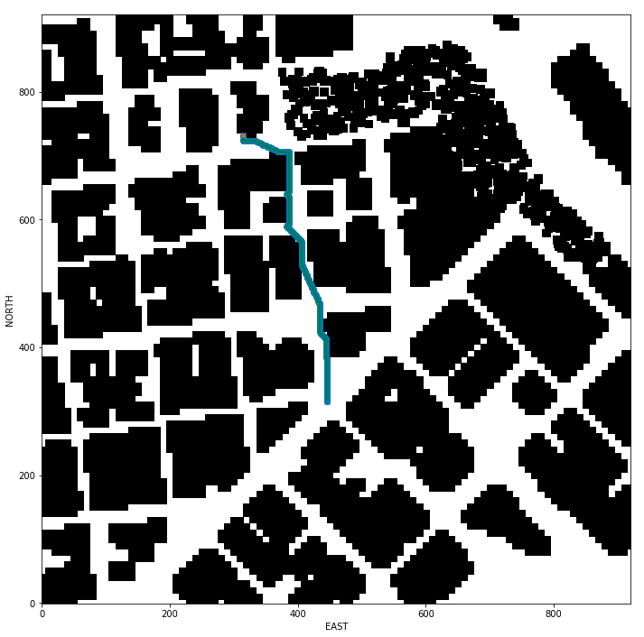
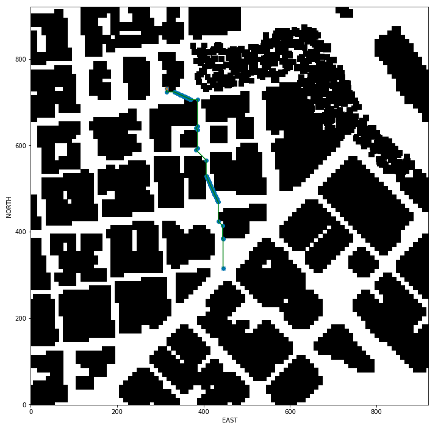
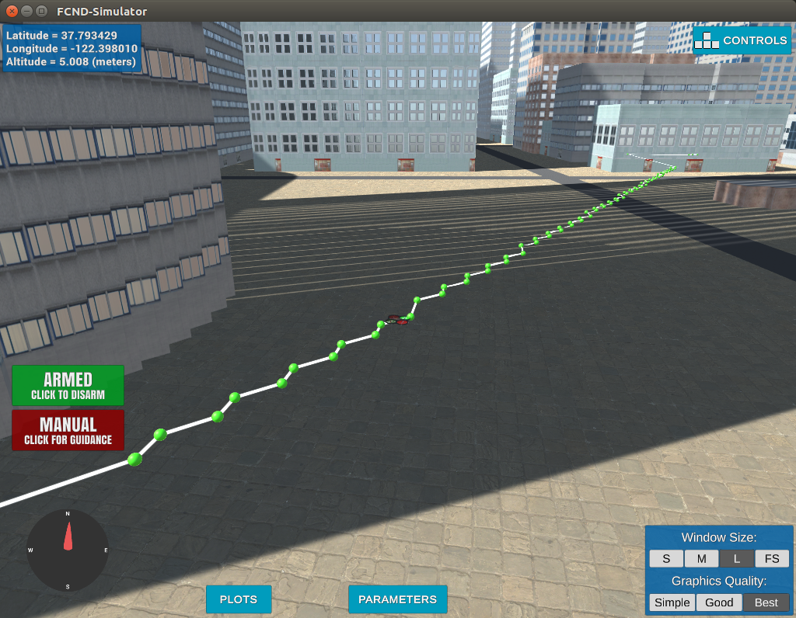

## Project: 3D Motion Planning

---

### The goals of this project are:
1. Loading a 2.5D map in the colliders.csv file describing the environment.
2. Discretize the environment into a grid or graph representation.
3. Define the start and goal locations.
4. Perform a search using A* or other search algorithm.
5. Use a collinearity test or ray tracing method (like Bresenham) to remove unnecessary waypoints.
6. Return waypoints in local ECEF coordinates (format for `self.all_waypoints` is [N, E, altitude, heading], where the drone’s start location corresponds to [0, 0, 0, 0].

---

### General structure of the code

The scripts `motion_planning.py` and `planning_utils.py` contain the basic planning implementation. Following 

#### `motion_planning.py`

 - connect to simulator
 - registering callbacks to messages returned from simulator
 - `local_position_callback()`:
 	 - when in state TAKEOFF: make sure the height is reached, then change to `waypoint_transition()`: change state to WAYPOINT, take next waypoint as target position, `cmd_position()`
 	 - when in state WAYPOINT: check if in vicinity (1m) of target location
 	 	- move to next waypoint or transition to landing if velocity is low enough (<1m/s), `landing_transition()`: change state to LANDING, `land()`
 - `velocity_callback()`:
 	 - when in state LANDING: check local and global position and transition to disarm, `disarming_transition()`: change state to DISARMING, `disarm()`, `release_control()`
 - state_callback():
 	 - MANUAL --> arming transition: `arm()`, `take_control()`
 	 - ARMING: if armed: `plan_path()`
 	 - PLANNING --> takeoff transition: change state to TAKEOFF, `takeoff()`
 	 - DISARMING: if not armed and guided --> `manual_transition()`: change state to MANUAL, `stop()`, set in_mission to False

- plan_path()
	- define target altitude and safety distance
	- set target position height to target altitude
	- read lattitude and longtitude from `colliders.csv` and set home position
	- convert global home position to relative local (north, east) position
	- read in obstacle map and convert to 2D grid at target altitude with safety distance using the method `create_grid()`
	- convert relative local position to grid local position
	- save specific global target positions in array and select one randomly
	- convert the global target lcoation to grid specific local position
	- use `a_star()` from `planning_utils.py` to find path from local start to goal
	- prune the path via `prune_path()` from `planning_utils.py`
	- convert path to waypoints, visualize them in simulator and follow them

#### `planning_utils.py`

 - contains the following methods:
 	- `create_grid()`
 	- `valid_actions()`
 	- `a_star()`
 	- `heuristic()`
 	- `collinearity_check()`
 	- `prune_path()`

And here's a lovely image of my results (ok this image has nothing to do with it, but it's a nice example of how to include images in your writeup!)

Here's | A | Snappy | Table
--- | --- | --- | ---
1 | `highlight` | **bold** | 7.41
2 | a | b | c
3 | *italic* | text | 403
4 | 2 | 3 | abcd

---

### Implementation of the Path Planning Algorithm

#### 1. Set your global home position
The first line of `colliders.csv` is read and the two values for `lat0` and `lon0` is extracted as float values. Those values are then used to set the global home position via the method `self.set_global_home_position()`.

<a href="/motion_planning.py#L126-L134">see `motion_planning.py`, line 126-134</a>

#### 2. Set your current local position
The local position relative to the gloabl home position is calculated via the method `global_to_local()` from `frame_utils.py`.

<a href="/motion_planning.py#L137">see `motion_planning.py`, line 137</a>

#### 3. Set grid start position from local position
The method `create_grid()` from `planning_utils.py` is used to calculate the grid as well as the offset positions for both directions - north and east. The offsets are then substracted from the current local position values to receive the grid starting positions.

<a href="/motion_planning.py#L145-L151">see `motion_planning.py`,  line 145-151</a>

#### 4. Set grid goal position from geodetic coords
A couple of predefined global goal positions are saved in the numpy array `global_goals`. One goal is then randomly selected and converted into a local goal position in respect to the gloabl home position via `global_to_local()`. The respective grid goal position is then calculated by adding the grid starting positions to the north and east position values.

<a href="/motion_planning.py#L161-L177">see `motion_planning.py`,  line 161-177</a>

#### 5. Modify A* to include diagonal motion
The A* implementation `a_star()` in `planning_utils()` was used to find a path from the start to the goal position. Additional actions for going diagonally were added to the Actions class and the method `valid_actions()` was modified to remove those new actions in case of a collision with an obstacle or out of bounds condition.

<a href="/planning_utils.py#L54-L61">see `planning_utils.py`, line 54-61</a> and
<a href="/planning_utils.py#L73-L101">line 73-101</a>

#### 6. Cull waypoints 
For this step you can use a collinearity test or ray tracing method like Bresenham. The idea is simply to prune your path of unnecessary waypoints. Explain the code you used to accomplish this step.

### Comparing A* with different actions and showing the effect of pruning 

### Execute the flight
#### 1. Does it work?
It works!

### Double check that you've met specifications for each of the [rubric](https://review.udacity.com/#!/rubrics/1534/view) points.
  
# Extra Challenges: Real World Planning

For an extra challenge, consider implementing some of the techniques described in the "Real World Planning" lesson. You could try implementing a vehicle model to take dynamic constraints into account, or implement a replanning method to invoke if you get off course or encounter unexpected obstacles.

